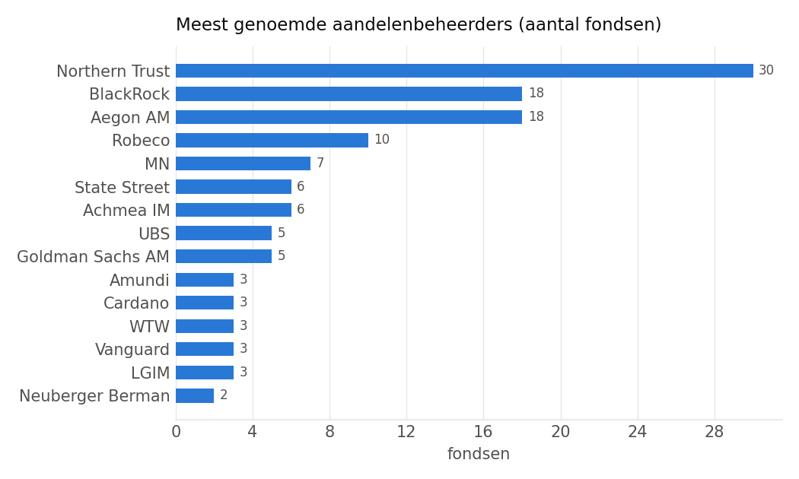
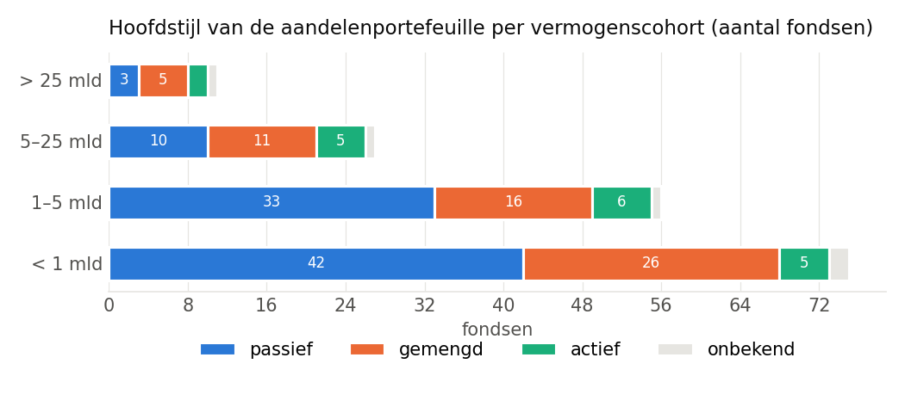
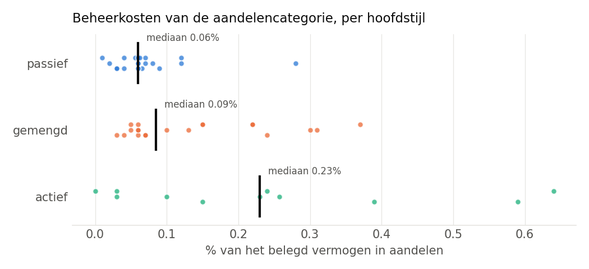
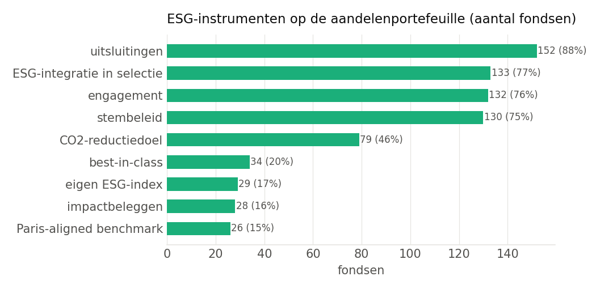

# De inrichting van de aandelenstrategie bij Nederlandse pensioenfondsen (jaarverslagen 2025)

Gelezen uit 173 jaarverslagen over 2025, samen € 1.639 miljard van de € 1.712 miljard bij 195 fondsen en kringen met een vermogen in de database (96% van het vermogen). Elk cijfer is door Gemini (gemini-3.8-flash-high) uit de verslagtekst gelezen, met pagina en letterlijke vindplaats in `equity_setup_2025`; zie de datakwaliteitsparagraaf onderaan voor wat ontbreekt.

## Samenvatting

- **Passief is de norm, actief de uitzondering.** 52% van de fondsen belegt de aandelen (vrijwel) volledig passief, 35% combineert een passieve kern met actieve satellieten (meestal opkomende markten of small caps), 10% is overwegend actief. Hoe kleiner het fonds, hoe vaker volledig passief; de grote fondsen zijn vaker gemengd omdat ze eigen maatwerkindices en actieve mandaten voeren.
- **Drie partijen bedienen de helft van de markt.** Northern Trust, BlackRock en Aegon AM worden samen door 66 van de 99 fondsen met een genoemde beheerder gebruikt, vrijwel altijd via gepoolde indexfondsen (CCF/FGR-structuren) met een ESG-screening of Paris-aligned variant. Robeco is de grootste actieve/enhanced partij (QI Conservative en Enhanced Index). De fiduciaire laag is nog geconcentreerder: Achmea IM, Aegon AM, Goldman Sachs AM, Van Lanschot Kempen en Columbia Threadneedle bedienen samen 94 van de 124 fondsen met een genoemde fiduciair.
- **Het product is bijna altijd een MSCI-index met een ESG-filter.** MSCI komt 155 keer voor als benchmark, FTSE 9 keer; 30 fondsen (vooral de grote) laten een eigen maatwerkindex bouwen. Northern Trust World SDG Screened Low Carbon, BlackRock Developed World ESG Screened en de Paris-Aligned-varianten zijn de standaardbouwstenen.
- **Passief kost een fractie van actief.** Waar het verslag de kosten per categorie noemt (55 fondsen) betaalt een passief fonds mediaan 0.06% van het belegd vermogen in aandelen, een actief fonds 0.23%; de grootste fondsen betalen het meest omdat zij actieve en illiquide strategieën voeren.
- **ESG is standaarduitrusting, klimaatdoelen niet.** Uitsluitingen (88%), engagement en stembeleid zijn vrijwel universeel; een geformuleerd CO2-reductiedoel heeft 44% van de fondsen, een Paris-aligned benchmark 15%. 113 fondsen zijn SFDR artikel 8, 21 artikel 6; artikel 9 komt niet voor.
- **Regionaal volgt men de wereldindex.** Waar een volledige verdeling wordt genoemd ligt Noord-Amerika mediaan rond 61% en opkomende markten rond 14%; een expliciete afwijking van de marktkapitalisatie (Europa-overweging, Nederland) is zeldzaam.
- **Valutarisico op aandelen wordt meestal half afgedekt.** Mediaan 50% bij 86 fondsen; volledig afdekken en helemaal niet afdekken komen allebei voor, het laatste met het argument dat de dollar in crises bescherming biedt.
- **De aandelenallocatie zelf** ligt mediaan rond 31% van het vermogen en is bij kleine fondsen hoger dan bij grote, waar private equity en andere illiquide categorieën een deel van het risicobudget innemen.

## 1. Hoeveel aandelen

| cohort (vermogen) | fondsen | feitelijk_mediaan | strategisch_mediaan | private_equity_mediaan |
|---|---|---|---|---|
| > 25 mld | 11 | 24.9 | 27.6 | 6.5 |
| 5–25 mld | 27 | 28.5 | 30.0 | 2.2 |
| 1–5 mld | 56 | 32.0 | 31.3 | 3.8 |
| < 1 mld | 75 | 33.4 | 31.5 | 0.5 |

Bron van het allocatiecijfer: feitelijk (verslag) 77, geen 50, feitelijk (berekend) 39, strategisch 7. Bij 26 fondsen noemt het verslag het aandelengewicht alleen binnen de rendementsportefeuille; dat is hier niet als allocatie geteld.

36 fondsen noemen een aparte private-equitypositie (mediaan 4.2%); bij 20 fondsen zit private equity in de aandelenpost zelf.

## 2. Wie beheert het

| cohort | extern | gemengd | intern |
|---|---|---|---|
| > 25 mld | 6 | 1 | 4 |
| 5–25 mld | 25 | 2 | 0 |
| 1–5 mld | 54 | 0 | 2 |
| < 1 mld | 75 | 0 | 0 |

Fiduciair beheerder genoemd bij 124 van de 173 fondsen:

| fiduciair / integraal beheerder | fondsen | vermogen_mld |
|---|---|---|
| Achmea IM | 36 | 198.9 |
| Aegon AM | 20 | 24.3 |
| Goldman Sachs AM | 19 | 28.1 |
| Van Lanschot Kempen | 10 | 50.0 |
| Columbia Threadneedle | 9 | 27.4 |
| BlackRock | 8 | 96.6 |
| MN | 7 | 154.6 |
| APG | 3 | 613.4 |
| intern | 2 | 48.7 |
| Russell Investments | 2 | 3.0 |
| Northern Trust | 1 | 0.3 |
| PGGM | 1 | 251.3 |
| AFAM | 1 | 1.4 |
| Neuberger Berman Ireland Ltd | 1 | 2.1 |
| NN IP / Goldman Sachs | 1 | 1.1 |

## 3. Welke partij en welk product

208 aandelenmandaten bij 99 fondsen, 38 verschillende partijen. Vermogen = het totale fondsvermogen van de fondsen die de partij noemen, niet de omvang van het mandaat.

| aandelenbeheerder | mandaten | fondsen | vermogen_mld |
|---|---|---|---|
| Northern Trust | 41 | 30 | 53.7 |
| Aegon AM | 31 | 18 | 26.1 |
| BlackRock | 33 | 18 | 80.0 |
| Robeco | 14 | 10 | 45.5 |
| MN | 7 | 7 | 154.6 |
| Achmea IM | 6 | 6 | 29.7 |
| State Street | 6 | 6 | 14.0 |
| Goldman Sachs AM | 7 | 5 | 21.0 |
| UBS | 6 | 5 | 99.7 |
| LGIM | 3 | 3 | 2.9 |
| Vanguard | 4 | 3 | 0.9 |
| WTW | 3 | 3 | 0.9 |
| Cardano | 3 | 3 | 7.2 |
| Amundi | 3 | 3 | 12.2 |
| Neuberger Berman | 2 | 2 | 64.2 |
| Univest (Unilever) | 2 | 2 | 6.0 |
| Russell Investments | 2 | 2 | 9.8 |
| Candriam | 4 | 2 | 60.1 |
| APG | 9 | 2 | 598.1 |
| DWS | 3 | 2 | 11.5 |

Beheerstijl per mandaat bij de twaalf meest genoemde partijen:

| beheerder | actief | enhanced/factor | onbekend | passief |
|---|---|---|---|---|
| Northern Trust | 0 | 0 | 0 | 41 |
| Aegon AM | 14 | 0 | 1 | 16 |
| BlackRock | 3 | 4 | 1 | 25 |
| Robeco | 7 | 7 | 0 | 0 |
| MN | 1 | 0 | 2 | 4 |
| Achmea IM | 0 | 1 | 1 | 4 |
| State Street | 0 | 0 | 0 | 6 |
| Goldman Sachs AM | 4 | 1 | 0 | 2 |
| UBS | 0 | 0 | 2 | 4 |
| LGIM | 0 | 0 | 0 | 3 |
| Vanguard | 0 | 0 | 0 | 4 |
| WTW | 3 | 0 | 0 | 0 |

Voorbeelden van genoemde producten/mandaten (191 met productnaam):

- **Achmea IM**: Aandelen opkomende markten beleggingsfonds; Achmea IM ESG Transition Emerging Markets Equity Fund; Achmea IM Emerging Markets Equity Fund; Coördinerend vermogensbeheer; Kwantitatieve multi-factorstrategie beleggingsfondsen (Beschikbarepremieregeling en Nettopensioenregeling)

- **Aegon AM**: AAM MSCI Emerging Markets; AEAM World Equity Index Fund (EUR); Aegon AM-beleggingsfondsen; Aegon World Equity Fund (EUR); MM Developed World Equity Index Fund; MM Global Emerging Markets Fund

- **BlackRock**: BlackRock Aandelen opkomende landen iShares; BlackRock Advantage Europe Ex-UK Equity Fund; BlackRock CCF Developed World (ESG screened) Index Fund; BlackRock CCF Developed World ESG Screened Index Fund; BlackRock CCF Developed World Index Fund (Paris Aligned Benchmark variant); BlackRock CCF Developed World Paris-Aligned Climate Index Fund

- **Goldman Sachs AM**: First Class Return Fund; First Class Return Index Fund; First class sustainable return Fund; GS EM EQ ESG PORT-I ACC EUR; Goldman Sachs Enhanced Index Sustainable; beleggingsmandaat verzekerd deel NN

- **LGIM**: L&G ESG Paris Aligned World Equity Index; SFDR artikel 8 breed gespreid aandelenfonds

- **MN**: ESG-indexportefeuille; MN beleggingsfonds; Mn Services Beleggingsfondsen; beleggingsfondsen van MN die beleggen in aandelen; specifieke beleggingsmandaten

- **Northern Trust**: Aandelen opkomende markten (fondsstructuur); Aandelenfondsen Northern Trust (Aandelen Developed Markets en Emerging Markets); MSCI EMU; NT Emerging Markets ESG Leader Index Fund; NT UCITS FGR EM Sust Select SD; NT World SDG Screened Low Carbon Index Fund

- **Robeco**: Aandelen opkomende markten; Robeco Emerging Markets Conservative Equity; Robeco QI Inst. Conservative Equity Fonds; Robeco QI Inst. Emerg.Markets Enhanced Index; Robeco QI Inst. Global Devel. Enhanced Index; Robeco QI Institutional Global Developed 3D Active Equity Fund

- **State Street**: SSIM CCF World ESG Screened Index Equity Fund; aandelenportefeuille ontwikkelde landen; discretionaire portefeuille; passief aandelenmandaat; passief discretionair wereldwijd aandelenmandaat; separaat aandelenmandaat (op maat gemaakte MSCI ACWI Climate Transition Benchmark)

- **UBS**: ESG-indexportefeuille; Replicatie MSCI World Small Cap Index (met beter CO2-profiel); UBS ETF (LU) MSCI Emerging Markets Socially Responsible; UBS aandelen ontwikkelde markten; UBS opkomende markten; passief beheerd aandelenmandaat met een maatwerk MSCI World ESG benchmark

## 4. Passief of actief

| cohort | actief | gemengd | onbekend | passief |
|---|---|---|---|---|
| > 25 mld | 2 | 5 | 1 | 3 |
| 5–25 mld | 5 | 11 | 1 | 10 |
| 1–5 mld | 6 | 16 | 1 | 33 |
| < 1 mld | 5 | 26 | 2 | 42 |

31 fondsen noemen een percentage passief beheerd: 26 daarvan volledig passief, de overige tussen 40% en 88%. Factorbeleggen expliciet bij 36 fondsen, expliciet niet bij 128.

Benchmarkfamilies voor aandelen: MSCI 155, overig/eigen 52, FTSE 9, STOXX 6, Solactive 3. Maatwerk/ESG-variant van de index (eigen_index) bij 30 fondsen.

## 5. Wat het kost

Beheerkosten van de aandelencategorie bij 55 fondsen genoemd: mediaan 0.07% (kwartielen 0.06–0.18%).

| hoofdstijl | fondsen | mediaan_pct | q25 | q75 |
|---|---|---|---|---|
| actief | 11 | 0.23 | 0.07 | 0.32 |
| gemengd | 20 | 0.09 | 0.06 | 0.22 |
| onbekend | 1 | 0.50 | 0.50 | 0.50 |
| passief | 23 | 0.06 | 0.05 | 0.07 |

| cohort | fondsen | mediaan_pct |
|---|---|---|
| > 25 mld | 5 | 0.22 |
| 5–25 mld | 11 | 0.10 |
| 1–5 mld | 19 | 0.07 |
| < 1 mld | 20 | 0.06 |

Fondsbrede vermogensbeheerkosten (alle categorieën) bij 128 fondsen: mediaan 0.34%; transactiekosten aandelen bij 39 fondsen (mediaan 0.02%); prestatievergoeding op aandelen bij 74.

## 6. De rol van ESG

| instrument | fondsen | aandeel |
|---|---|---|
| uitsluitingen | 152 | 88% |
| ESG-integratie in selectie | 133 | 77% |
| engagement | 132 | 76% |
| stembeleid | 130 | 75% |
| CO2-reductiedoel | 79 | 46% |
| best-in-class | 34 | 20% |
| eigen ESG-index | 29 | 17% |
| impactbeleggen | 28 | 16% |
| Paris-aligned benchmark | 26 | 15% |

SFDR-artikel: artikel 6 21, artikel 8 113, niet genoemd 39. CO2-reductiedoel geformuleerd bij 76 fondsen.

Voorbeelden van CO2-doelen:

- ABP (Government and Education): verlaging van 50% van de CO2-uitstoot van onze beleggingen in 2030 (ten opzichte van 2019), om in 2050 een klimaatneutrale portefeuille te bereiken

- Metalektro / PME: -50% in 2030 t.o.v. 2019 (en netto nul in 2050)

- Beroepsvervoer over de Weg (Commercial Road Transport): het streven is om in 2030 een CO2-voetafdruk hebben die 50% lager is dan die van de benchmark eind 2020; langetermijndoelstelling klimaatneutrale portefeuille in 2050

- Detailhandel (Retail): lager dan de standaard benchmarks

- Shell (SSPF): SSPF streeft daarbij naar een verbetering van de CO₂-intensiteit van de portefeuille in de tijd, met als einddoel net zero in 2050.

- Rail & Openbaar Vervoer (Rail & Public Transport): -50% in 2030 en Net zero in 2050 t.o.v. 2019

- Rabobank: CO2-intensiteit van de aandelenportefeuille 50% lager dan in het basisjaar 2019; stapsgewijs verlagen richting een klimaatneutraal niveau in 2050

- BPL Pensioen (Agriculture): Voldoen aan de doelstelling om minder emissies te financieren dan nodig is volgens een op de EU Climate Transition Benchmark afgestemd reductiepad (in 2025: 33,7 tCO2/mio euro belegd vermogen)

## 7. Regioverdeling

Regioverdeling genoemd bij 101 fondsen (benchmark 1, feitelijk 68, strategisch 32).

Bij de 40 fondsen met een volledige verdeling (som 90–110%):

| regio | fondsen | gemiddeld_pct | mediaan_pct |
|---|---|---|---|
| Wereld ontwikkeld | 20 | 86.2 | 87.5 |
| Noord-Amerika | 19 | 56.8 | 61.4 |
| Europa | 20 | 24.3 | 17.0 |
| Opkomende markten | 29 | 14.7 | 13.7 |
| Azië-Pacific | 19 | 12.0 | 11.1 |
| Overig | 12 | 3.7 | 2.0 |

Gewicht opkomende markten: mediaan 14% (n=29); Nederland apart genoemd bij 1 fondsen.

## 8. Valuta

Afdekking van het valutarisico op aandelen genoemd bij 86 fondsen: mediaan 50%, 6 dekken niets af, 8 dekken volledig af.

## 9. Wat ontbreekt en wat afwijkt

| veld | ontbreekt bij | van |
|---|---|---|
| aandelenallocatie | 50 | 173 |
| beheerder genoemd | 74 | 173 |
| hoofdstijl onbekend | 5 | 173 |
| beheerkosten aandelen | 118 | 173 |
| SFDR-artikel | 39 | 173 |
| regioverdeling | 72 | 173 |

Vergelijking met de oudere velden in `funds`/`equity_strategy` staat in de uitvoer van `laad_aandelen.py`.
